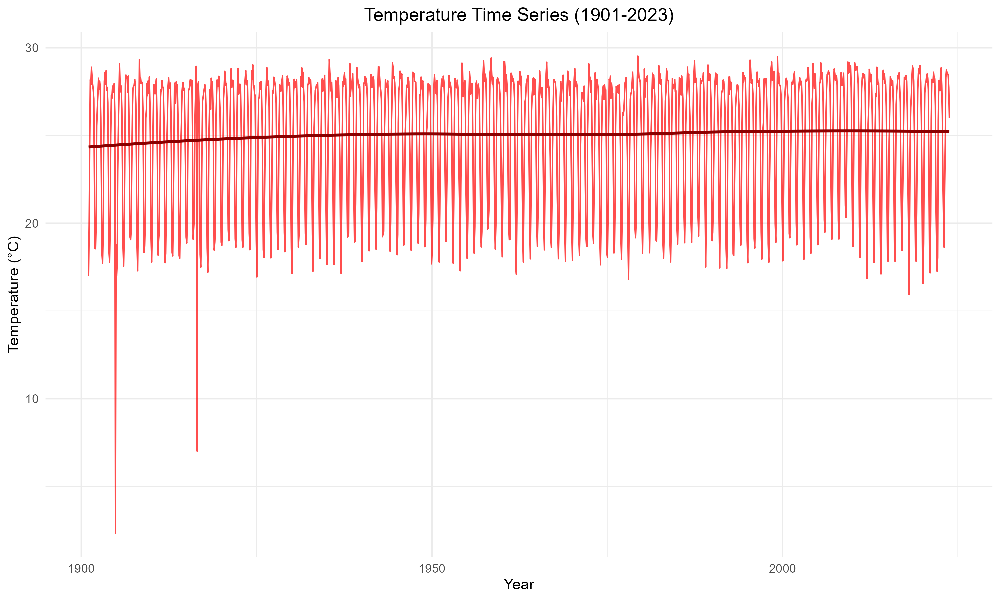
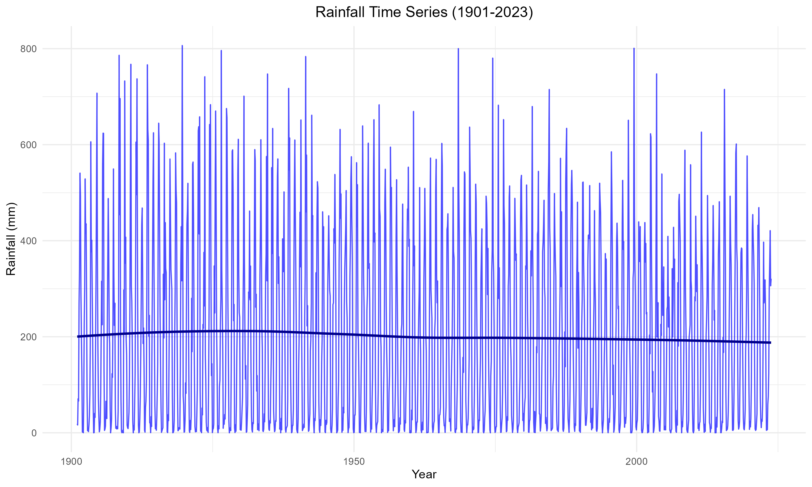
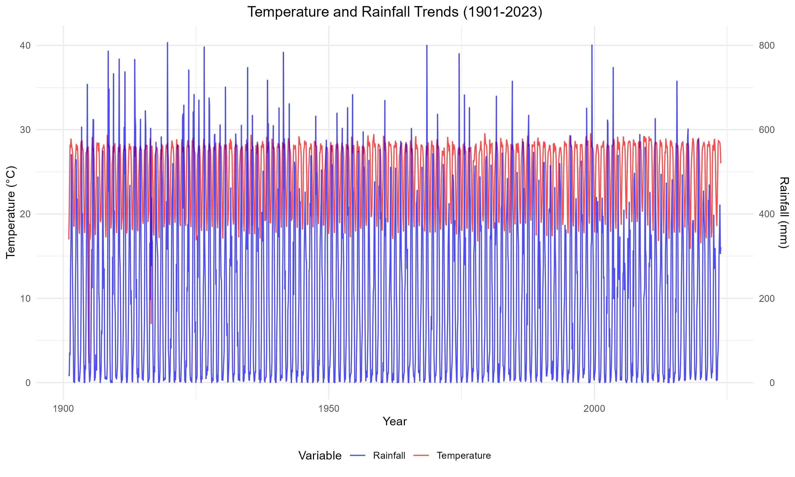
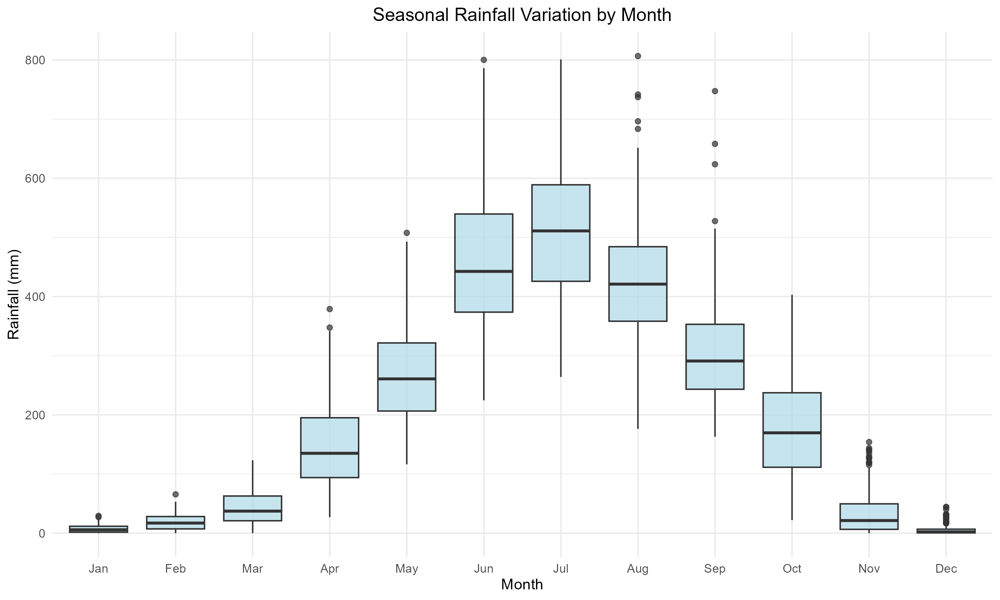
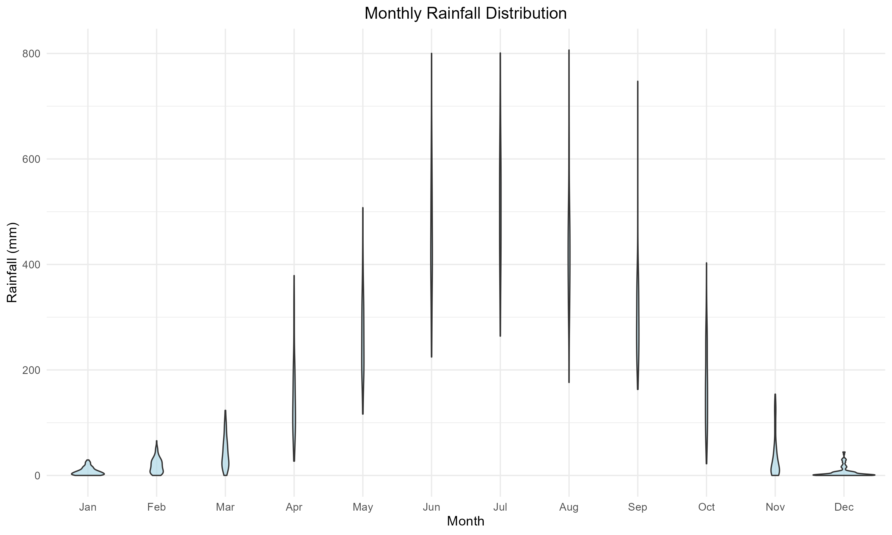
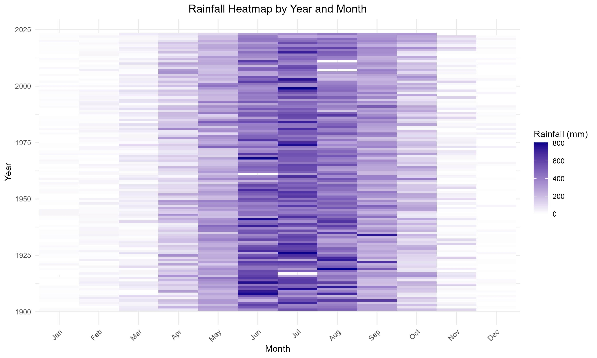
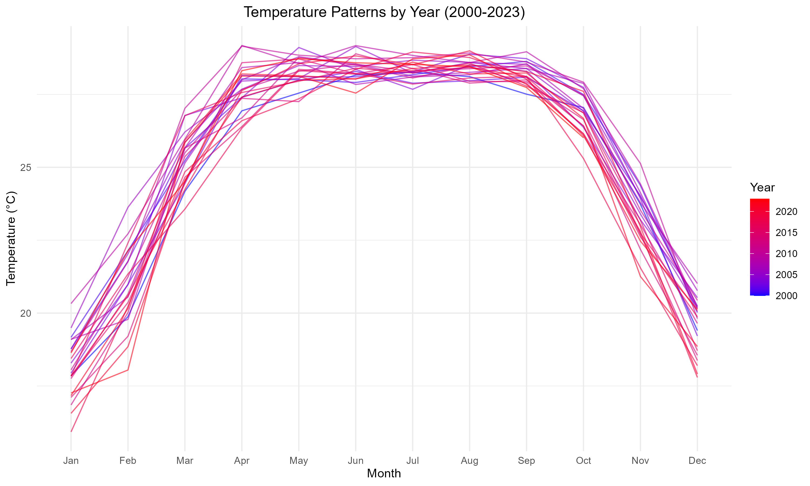

# Climate Data Analysis: Long-Term Temperature and Rainfall Trends (1901–2023)

## Project Overview

This project presents a comprehensive Exploratory Data Analysis (EDA) of historical climate data spanning over a century, from 1901 to 2023. Using the R programming language, the analysis focuses on cleaning raw meteorological data, detecting and removing statistical outliers, and generating high-quality visualizations to uncover long-term trends in temperature and rainfall patterns.

The goal of this project is to provide actionable insights into climate behavior over time, including seasonal variations, annual trends, and the relationship between temperature and precipitation. The analysis is structured to be reproducible, well-documented, and suitable for academic or professional presentation.

---

## Dataset Description

The dataset used in this project contains monthly climate records for a period of 123 years. It includes the following key variables:

| Column Name | Description                          | Data Type |
|-------------|--------------------------------------|-----------|
| `Year`      | The year of the observation (1901–2023) | Integer   |
| `Month`     | The month of the observation (1–12)     | Integer   |
| `tem`       | Average temperature in Celsius          | Numeric   |
| `rain`      | Total rainfall in millimeters           | Numeric   |

**Input File:** `sorted_temp_and_rain_dataset.csv`  
**Output File:** `cleaned_climate_data.csv`

---

## Data Processing Pipeline

The analysis follows a structured data processing pipeline to ensure data quality and reliability.

### 1. Data Cleaning
- Removed unnecessary columns (e.g., `name`) to streamline the dataset.
- Handled missing values using **linear interpolation** (`approx` function) for numeric columns.
- Corrected invalid entries, such as negative rainfall values, by setting them to zero.

### 2. Outlier Detection and Removal
- Applied the **Interquartile Range (IQR)** method to identify outliers in rainfall data.
- Outliers beyond 1.5 × IQR were flagged and removed to improve trend accuracy.
- Temperature outliers were assessed using standard deviation thresholds (>3 SD).

### 3. Data Validation
- Verified data ranges for temperature, rainfall, month, and year.
- Ensured no missing values remained after cleaning.
- Generated summary statistics for final validation.

---

## Visualization and Analysis

The project includes a wide range of visualizations to explore both temporal and seasonal patterns.

### 1. Time Series Trends
Long-term trends in temperature and rainfall were visualized using line plots with LOESS smoothing. A dual-axis plot was also created to compare both variables simultaneously.





### 2. Seasonal Analysis
Seasonal patterns were analyzed using boxplots, violin plots, and monthly average line charts. These plots reveal distinct wet and dry seasons and highlight the variability in rainfall distribution.




### 3. Heatmaps and Annual Patterns
A heatmap was generated to visualize rainfall intensity by year and month. Additionally, temperature patterns for the most recent two decades (2000–2023) were plotted to observe year-to-year variations.




### 4. Correlation and Trend Analysis
- A linear regression model (`lm`) was used to quantify temperature and rainfall trends over time.
- Correlation analysis was performed to assess the relationship between temperature and rainfall.

---

## Key Findings

- **Temperature Trend:** A statistically significant warming trend was observed, with temperatures increasing steadily over the century.
- **Rainfall Trend:** Rainfall patterns remained relatively stable, with high annual variability and no strong linear trend.
- **Seasonality:**
  - The hottest months typically occur in the mid-year period.
  - The wettest months are concentrated in a specific monsoon season, as shown in the boxplots and heatmaps.
- **Correlation:** A weak or negligible correlation was found between temperature and rainfall on a monthly basis.

---

## Requirements

To run this analysis, you need R installed along with the following packages:

```r
install.packages(c("dplyr", "tidyr", "ggplot2", "lubridate"))
